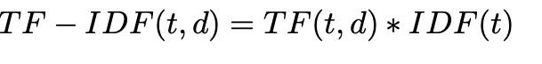

# Proposta do Trabalho

O objetivo é ranquear os documentos de acordo com a relevância de cada um para uma frase de pesquisa específica, utilizando a métrica TF/IDF para calcular tal relevância.

- Um conjunto de arquivos de texto contendo documentos aleatórios.
- Deverá ser preparado uma lista de frases de pesquisa, onde cada frase deve ser comparada aos documentos fornecidos para determinar a relevância de cada arquivo em relação à frase.


# O Algoritmo

```INPUT```

O projeto utiliza quatro tipos principais de arquivos de entrada para o processamento: frases de pesquisa, documentos, uma lista de stopwords e a implementação do algoritmo de Merge Sort para ordenação. Cada um desses elementos é essencial para garantir a preparação adequada dos dados, a normalização, a ordenação das palavras e o ranqueamento dos documentos.

O arquivo de frases de pesquisa contém, em cada linha, uma frase que serve como critério de busca para ranquear documentos. Essas frases são lidas por meio da função ```lerFrasesDePesquisa```, que as armazena em um vetor (```vector<string>```). Após carregadas, essas frases são utilizadas como consultas para comparação com o conteúdo dos documentos processados.

Os documentos são lidos de uma pasta específica, onde cada arquivo representa um documento individual. A função ```lerDocumentos``` percorre todos os arquivos da pasta fornecida, extraindo suas palavras e armazenando-as em um vetor de vetores (```vector<vector<string>>```), onde cada subvetor representa um documento completo.

O arquivo de stopwords contém uma lista de palavras comuns que não agregam valor à análise semântica, como artigos e preposições, e que precisam ser removidas dos documentos. A função ```lerStopwords``` carrega essas palavras em uma estrutura de conjunto (```unordered_set<string>```), permitindo buscas pelos documentos e a remoção durante a normalização do texto. Durante o processo de normalização dos documentos, essas stopwords são eliminadas, de forma a garantir que apenas termos relevantes sejam utilizados na comparação.

Após a leitura dos documentos e das stopwords, é realizada uma normalização do conteúdo textual. Esse processo converte todas as palavras para letras minúsculas e remove caracteres não alfabéticos. Em seguida, a função ```normalizarDocumentos``` aplica a remoção das stopwords, eliminando termos irrelevantes e deixando apenas palavras significativas para serem utilizadas nos cálculos de relevância e ranqueamento.

Com o método de ordenação ```Merge Sort```, é possível fazer a ordenação dos resultados de busca. Implementado tanto no ranqueamento por frequência de termos quanto no cálculo de ```TF-IDF```, esse método é utilizado para organizar os documentos de forma decrescente, com base em suas relevâncias ou frequências. Esse método divide recursivamente o vetor de resultados em subvetores menores, até que cada um contenha um único elemento, e então realiza a mesclagem ordenada dos elementos. 

```Frases utilizadas no INPUT```


```
O céu está muito azul hoje  
Acordei de bom humor  
Comprei frutas no mercado  
A tarde foi bem tranquila  
Preciso organizar minha mesa  
O cachorro está brincando no quintal  
A água do rio é cristalina  
Hoje é um bom dia para correr  
A comida ficou salgada demais  
Vamos tomar sorvete mais tarde  
Estou com saudade da praia  
O livro novo é muito interessante  
A cidade está silenciosa à noite  
Gosto de ver o pôr do sol  
A brisa da manhã é refrescante  
O bolo acabou de sair do forno  
Vou assistir uma série hoje  
As crianças estão brincando na praça  
Preciso encontrar meus óculos  
O jantar foi perfeito  
```


```OUTPUT```

O objetivo é exibir quais documentos são mais relevantes para cada frase de pesquisa, utilizando duas abordagens: frequência de termos e TF-IDF. 

A função principal responsável por coordenar a saída de dados é a output, localizada no arquivo ```print.cpp```. Nessa função, após a leitura, normalização e processamento dos documentos, são realizados os cálculos de relevância para cada frase de pesquisa. O processo utiliza as duas abordagens implementadas: frequência de termos, por meio da função ```ranquearDocsFrequencia```, e TF-IDF, por meio da função ```ranquearDocsTFIDF```. Ambos os métodos avaliam a presença e relevância dos termos das frases de pesquisa nos documentos, gerando rankings ordenados.

No método de frequência de termos, o output exibe os documentos em ordem decrescente com base no número de vezes que os termos da frase de pesquisa aparecem em cada documento. A função ```ranquearDocsFrequencia``` é responsável por calcular e exibir o ranking no terminal, indicando para cada documento o termo mais frequente e sua contagem. O Merge Sort é utilizado para garantir que os documentos sejam exibidos do mais relevante para o menos relevante, com base na frequência.

Na segunda abordagem, baseada no TF-IDF, o cálculo considera não apenas a frequência dos termos, mas também a raridade desses termos nos demais documentos, gerando uma medida de relevância mais precisa. A função ```ranquearDocsTFIDF``` calcula os pesos dos termos e utiliza o ```Merge Sort``` para ordenar os documentos por relevância de forma eficiente. O output exibe o resultado no terminal com precisão de seis casas decimais, destacando para cada frase de pesquisa os documentos mais relevantes e seus respectivos pesos.

Cada ranking gerado é apresentado com um cabeçalho que indica a frase de pesquisa utilizada, seguido por uma lista detalhada de documentos. Para a abordagem por frequência, são exibidos os termos mais relevantes e suas contagens; já para o método TF-IDF, cada linha mostra o peso calculado para o documento correspondente. 


```Alguns exemplos de OUTPUT```

```

Ranqueamento dos Documentos para a Frase: "O bolo acabou de sair do forno  "
Documento 2 - Relevância: 0.036639
Documento 3 - Relevância: 0.032949
Documento 5 - Relevância: 0.030802
Documento 6 - Relevância: 0.027848
Documento 1 - Relevância: 0.027803
Documento 4 - Relevância: 0.025803
---

Ranqueamento dos Documentos para a Frase: "Vou assistir uma série hoje  "
Documento 3 - Relevância: 0.005010
Documento 6 - Relevância: 0.004826
Documento 1 - Relevância: 0.004563
Documento 4 - Relevância: 0.004264
Documento 5 - Relevância: 0.001964
Documento 2 - Relevância: 0.000273
---

Ranqueamento dos Documentos para a Frase: "As crianças estão brincando na praça  "
Documento 2 - Relevância: 0.003828
Documento 4 - Relevância: 0.003514
Documento 3 - Relevância: 0.003339
Documento 5 - Relevância: 0.003244
Documento 1 - Relevância: 0.002980
Documento 6 - Relevância: 0.002937
---

```

# Estruturas

```TF-IDF```

O método TF-IDF (Term Frequency-Inverse Document Frequency) é uma técnica bastante utilizada em mineração de textos e recuperação de informações para avaliar a importância de um termo específico em um documento dentro de um conjunto de documentos. A importância é determinada pela frequência do termo no documento e pela raridade do termo nos demais documentos do corpus.

A fórmula do TF (Term Frequency) apresentada é:

</p>

<p align="center">

</p>
<p align="center">
<em>Imagem 1: Fórmula do método TF. </em>

</p>

O valor de TF quantifica a frequência de um termo t em um documento d. Ele é utilizado para medir a relevância local de um termo dentro de um documento específico, dando maior peso aos termos que aparecem com maior frequência.

O IDF (Inverse Document Frequency) é definido por:

</p>

<p align="center">

</p>
<p align="center">
<em>Imagem 2: Fórmula do método IDF. </em>

</p>

Nesta fórmula, N representa o número total de documentos no corpus e df é a quantidade de documentos que contêm o termo t. A adição de 1 no denominador serve para evitar divisões por zero. O IDF mede a relevância global do termo, atribuindo maior peso a termos que aparecem em menos documentos.

A combinação dessas duas métricas resulta no cálculo do TF-IDF, conforme mostrado na equação:

</p>

<p align="center">

</p>
<p align="center">
<em>Imagem 3: Fórmula do método TF-IDF. </em>

</p>

O valor de TF-IDF é, portanto, um produto da frequência do termo no documento e sua raridade no conjunto de documentos. Essa métrica é útil para destacar termos que são frequentes em um determinado documento, mas incomuns no restante do corpus, o que pode indicar uma maior relevância na diferenciação de conteúdos.


```MergeSort```

O Merge Sort é um algoritmo de ordenação eficiente que utiliza a abordagem "dividir para conquistar" (divide and conquer). Ele funciona dividindo recursivamente a lista original em sublistas menores, até que cada sublista contenha apenas um elemento ou nenhum (o que garante que estejam, por definição, ordenadas). Em seguida, essas sublistas são combinadas (ou mescladas) de maneira ordenada para formar a lista final organizada.

No processo, o algoritmo primeiro divide a lista na metade repetidamente. Uma vez que todas as divisões são feitas, começa a fase de mesclagem, onde as sublistas são comparadas elemento a elemento e reordenadas à medida que são combinadas. Como mostrado no gif, a sequência de divisão e mesclagem ocorre até que a lista completa esteja em ordem crescente.

O Merge Sort possui um desempenho consistente, com complexidade de tempo O(nlogn) tanto no melhor quanto no pior caso, o que o torna eficiente para grandes volumes de dados. No entanto, ele pode exigir espaço extra proporcional ao tamanho da lista, já que precisa armazenar temporariamente as sublistas durante a fase de mesclagem.

</p>

<p align="center">

</p>
<p align="center">
<em>Imagem 4: Método de Organização do MergeSort. </em>

</p>

```Análise das estruturas```


O ```Merge Sort``` foi escolhido não apenas por sua estabilidade, mas também para explorar novas estruturas e promover aprendizado no contexto deste trabalho, como o uso de tuplas e pares na manipulação dos dados. Além disso, sua eficiência em lidar com grandes volumes de documentos foi um fator a ser considerado também, já que sua abordagem de dividir para conquistar garante desempenho consistente com complexidade ```O(nlogn)```, independentemente da distribuição dos dados.

Embora o ```Quick Sort``` pudesse ser mais rápido em casos específicos, ele apresenta riscos de pior desempenho ```O(n²)``` com dados desbalanceados e não preserva a ordem relativa de documentos com relevâncias iguais. O ```Heap Sort```, por sua vez, apesar de garantir ```O(nlogn)```, não é estável e pode introduzir ```overhead``` na manipulação da heap, prejudicando a eficiência em estruturas mais complexas. 

# Conclusão

Com a implementação do Merge Sort e das demais estruturas utilizadas neste projeto, foi possível não apenas aprofundar o conhecimento sobre algoritmos de ordenação, mas também compreender melhor a aplicação prática de estruturas como tuplas e pares. O uso desse algoritmo permitiu explorar como a ordenação estável e eficiente pode impactar o processamento de grandes volumes de documentos, garantindo a consistência necessária para a apresentação dos resultados. 

# Compilação e Execução

O algoritmo disponibilizado possui um arquivo Makefile que realiza todo o procedimento de compilação e execução. Para tanto, temos as seguintes diretrizes de execução:

<div>

| Comando                |  Função                                                                                           |
| -----------------------| ------------------------------------------------------------------------------------------------- |
|  `make clean`          | Apaga a última compilação realizada contida na pasta build                                        |
|  `make`                | Executa a compilação do programa utilizando o gcc, e o resultado vai para a pasta build           |
|  `make run`            | Executa o programa da pasta build após a realização da compilação                                 |

</div>
